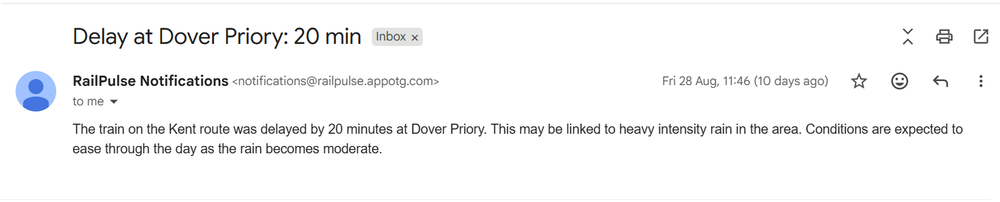
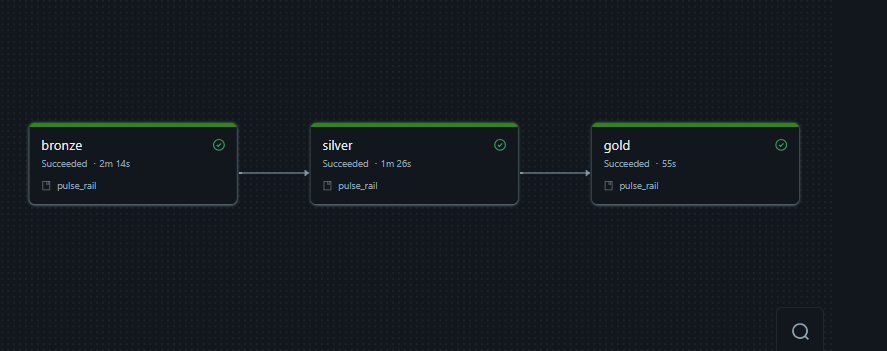

<p align="center">
  <picture>
    <source media="(prefers-color-scheme: dark)" srcset="https://raw.githubusercontent.com/Berachaiah/railpulse/main/static/images/railpulse-logo-light.png">
    
  </picture>
</p>

# 🚆 RailPulse

> Turning live railway data into intelligent, passenger focused information.

RailPulse is a railway intelligence platform that helps UK rail passengers understand their journeys, railway conditions, disruptions, and relevant travel information. It combines a passenger facing web application with a Databricks Lakehouse data platform and an AI notification system.

This repo brings together the two parts of RailPulse as submodules and documents how they fit together.

🌐 Live Application: http://railpulse-mu.vercel.app/

| Component | Repo |
|---|---|
| Passenger app (`app/`) | [Berachaiah/railpulse](https://github.com/Berachaiah/railpulse) |
| Notification agent (`notification-agent/`) | [Olahzie/Railpulse-Notification-Agent](https://github.com/Olahzie/Railpulse-Notification-Agent) |

---

## 📖 Overview

RailPulse is built around three layers:

1. **Passenger application** (`app/`) — FastAPI backend, Jinja2/HTML/CSS/JS frontend, Supabase/PostgreSQL. Handles auth, sessions, accounts, journey info, and notification delivery to users.
2. **Railway data engineering platform** (`notification-agent/`) — Databricks Lakehouse, Bronze, Silver, Gold medallion pipeline processing Network Rail and OpenWeather data into reliability analytics and disruption context.
3. **AI notification system** (`notification-agent/`) — LangGraph agent deployed via MLflow and Databricks Model Serving, matches disruptions to rider preferences and generates notification content, delivered by SMTP (appotg.com).

## 🎯 Problem

Raw railway data tells you what a train is doing. It does not tell a passenger what that means for them: whether their route is affected, whether a delay is serious enough to worry about, or whether weather is going to make it worse. RailPulse closes that gap between operational data and passenger relevant information.

## 🏗️ System Architecture

```text
Network Rail (STOMP)
OpenWeather              Kafka (Confluent Cloud)     Databricks Lakehouse
                                                            |
                                                Bronze  >  Silver  >  Gold
                                                            |
                                    Reliability   Weather/Train   ai_alert
                                     Analytics     Enrichment    (disruption
                                                                    context)
                                                            |
                                          LangGraph Notification Agent
                                            (MLflow + Model Serving)
                                              |               |
                                    Rider Preferences    Alert History
                                              |
                                     SMTP (appotg.com)
                                              |
                          RailPulse Passenger App
                          FastAPI, Auth, Supabase/Postgres
                          Jinja2 Web UI (Vercel)
                                              |
                                          Passenger
```

The `app` folder (`Berachaiah/railpulse`) owns auth, session management, application logic, the Supabase backed data layer, and the passenger facing UI.

The `notification-agent` folder (`Olahzie/Railpulse-Notification-Agent`) owns ingestion, the medallion pipeline, reliability and enrichment jobs, and the LangGraph agent that decides who gets notified and what the message says.

## 🖼️ Architecture Diagram


## 📡 Real Time Data Pipeline

Live railway and weather data is streamed through a dedicated Kafka setup on Confluent Cloud before it ever reaches the Lakehouse.

- **Cluster**: `lkc-mv21now` ("RailPulse"), GCP `europe-west2`, Standard tier, in environment `env-3kw0rm` under the "Heartfelt Services Ltd" organization.
- **Topics**: `weather-updates`, `weather-forecast`, `train-schedule-vstp`, `train-movements`, `train-schedule`, `corpus-reference` — created via the Confluent CLI.
- **Producers**: a set of continuously running pollers and listeners (`weather-poller`, `forecast-poller`, `vstp-listener`, `stomp-listener`, `schedule-poller`, `corpus-poller`) hosted on the `appotg.com` shared server, publishing into those topics. Managed via `watchdog.sh` / `start_producers.sh`, with shared config in `shared/kafka_config.py`.
- **Access**: the pollers authenticate with a personal Confluent API key/secret. A separate service account, `railpulse-partner`, was created with its own API key/secret and scoped via ACLs to read/write/describe on all six topics plus consumer group read/describe, so the notification agent side can consume independently of the producer credentials.
- **History**: the original Confluent Cloud trial expired, so a new account and cluster were set up, all six topics recreated, producer credentials rotated, and message flow to the new cluster confirmed before the old one was retired.

## 🔄 End to End Data Flow

1. **Ingestion** — Network Rail (STOMP) and OpenWeather data stream through the Confluent Kafka topics above.
2. **Bronze** — raw events land in the Lakehouse largely as is.
3. **Silver** — cleaning, deduplication, schema normalization for both railway and weather data.
4. **Gold** — business level outputs: route and station reliability, weather/train enrichment, and `ai_alert` disruption context.
5. **Notification Agent** — a scheduled dispatch job calls the deployed LangGraph agent via Model Serving with the alert; the agent matches it against rider preferences and recent alert history, then generates a message.
6. **Delivery** — the message goes out via SMTP from appotg.com; dispatch and outbox state is recorded, and the passenger app receives it through a webhook.
7. **Passenger app** — serves the passenger's account, preferences, and journey/notification history through the FastAPI and Supabase backed web UI.

## 📸 Screenshots

**A disruption notification delivered to a passenger's inbox:**



**A Bronze → Silver → Gold pipeline run in Databricks:**



## 🛠️ Features

- FastAPI app backed by Supabase/PostgreSQL, with `User`, `UserPreference`, and `Notification` models.
- Firebase Authentication with Google sign-in and JWT-based sessions.
- Deployed to Vercel, with a `/webhooks/notifications` endpoint (secret-header authenticated) that receives notifications from the Databricks/agent side.
- Weather-based delay predictions and route-change alerts, surfaced through the dashboard, preferences, and notifications pages.
- Databricks Lakehouse with Bronze, Silver, and Gold pipelines processing railway and weather data.
- Route and station reliability analytics, weather/train enrichment, and `ai_alert` disruption context generation.
- LangGraph notification agent deployed through MLflow and Databricks Model Serving, matching alerts to rider preferences and alert history and generating notification content.
- Rider preference synchronization and notification dispatch/outbox architecture connecting Supabase rider data to the Databricks environment.

## 🛠️ Technology Stack

| Category | Technology |
|---|---|
| Backend (app) | FastAPI |
| Frontend (app) | HTML, Jinja2, CSS, JavaScript |
| Application DB | PostgreSQL / Supabase |
| Auth | Firebase Authentication (Google sign-in) |
| Railway data | Network Rail STOMP |
| Weather data | OpenWeather |
| Event streaming | Apache Kafka (Confluent Cloud) |
| Data processing | Apache Spark |
| Data platform | Databricks (Delta Lake, Medallion architecture) |
| AI agent | LangGraph |
| Model serving | Databricks Model Serving |
| Model management | MLflow |
| Data governance | Unity Catalog |
| Email delivery | SMTP (appotg.com) |
| App deployment | Vercel |

## ⚠️ Known Limitations

- **Model Serving permissions** — the notification agent's serving endpoint has limited direct access to some notification tables; dispatch currently works around this via MLflow trace data.
- **Unity Catalog function grants** — recreating UC functions can drop existing `EXECUTE` grants; setup reapplies them.
- **Secrets** — any remaining hardcoded credentials in setup scripts should move to Databricks secret scopes or another secret manager before production use.

---

Live app: http://railpulse-mu.vercel.app/
